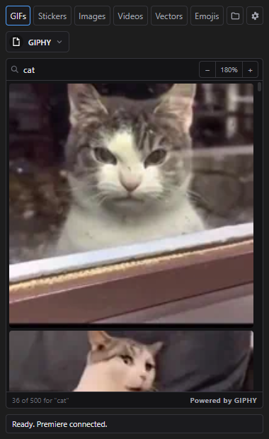
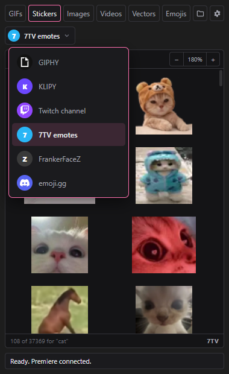
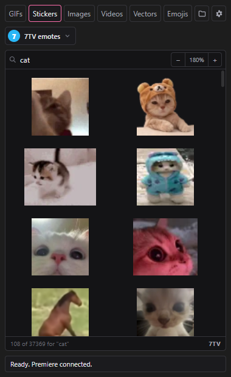
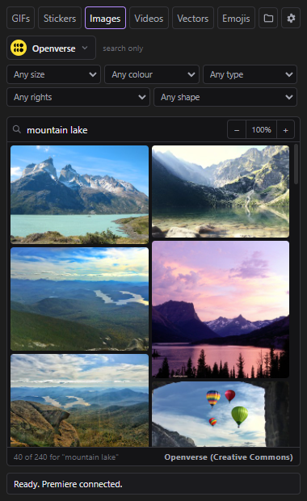
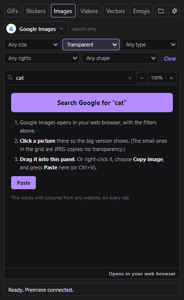
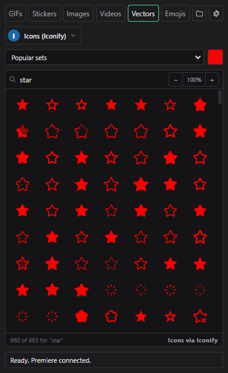
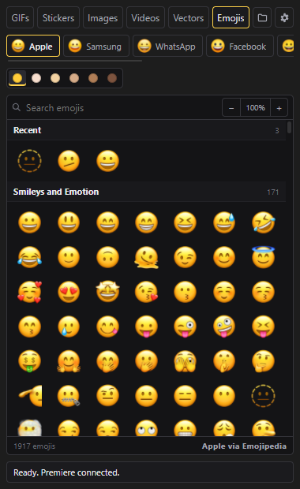

# Zen Stickers user guide

Everything Zen Stickers can do, in the order you will need it.
Click a line to jump there.

**Getting started**
1. [Install](#1-install)
2. [Open the panel](#2-open-the-panel)
3. [The panel at a glance](#3-the-panel-at-a-glance)
4. [Add your free keys](#4-add-your-free-keys)

**Finding things**
5. [Search and import](#5-search-and-import)
6. [GIFs](#6-gifs)
7. [Stickers and Twitch emotes](#7-stickers-and-twitch-emotes)
8. [Images and the filter bar](#8-images-and-the-filter-bar)
9. [Google Images](#9-google-images)
10. [Videos](#10-videos)
11. [Vectors: icons and SVGs](#11-vectors-icons-and-svgs)
12. [Emojis](#12-emojis)
13. [Drag or paste anything in](#13-drag-or-paste-anything-in)

**Working with the results**
14. [Where things go on the timeline](#14-where-things-go-on-the-timeline)
15. [Looping short GIFs](#15-looping-short-gifs)
16. [Zoom and preview](#16-zoom-and-preview)
17. [Right-click menu](#17-right-click-menu)
18. [Where the files are saved](#18-where-the-files-are-saved)

**Reference**
19. [Every setting](#19-every-setting)
20. [Keyboard and mouse](#20-keyboard-and-mouse)
21. [Update and uninstall](#21-update-and-uninstall)
22. [Problems and fixes](#22-problems-and-fixes)
23. [Privacy and licences](#23-privacy-and-licences)

---

## 1. Install

You need **Premiere Pro 2021 (15.0) or newer**, or **After Effects 2022 (22.0) or newer**.
SVG files in After Effects need version 2025 or newer.

### Windows

1. Go to the [Releases page](https://github.com/Zengane/ZenStickers/releases) and open the newest release.
2. Download two files: `ZenStickers-x.y.z.zxp` and `Install on Windows.cmd`.
3. Put both files in the same folder, for example Downloads.
4. Close Premiere Pro and After Effects.
5. Double-click `Install on Windows.cmd`. It uses Adobe's own installer, which comes
   with Creative Cloud. When it says **Done**, press a key to close it.

### macOS

1. Download `ZenStickers-x.y.z.zxp` and `Install on macOS.command` from the newest release.
2. Put both in the same folder.
3. Close Premiere Pro and After Effects.
4. Right-click `Install on macOS.command` and choose **Open** (the first time, macOS
   asks if you trust it). When it says **Done**, close the window.

### Another way (both systems)

Open the `.zxp` file with a ZXP installer, for example **ZXP Installer** by aescripts
(free). Drag the file onto its window.

> The macOS version has not been tested yet. Please report what works and what does not.

---

## 2. Open the panel

1. Start Premiere Pro or After Effects.
2. Choose **Window > Extensions > Zen Stickers**.
3. Drag the panel's tab into your workspace where you want it, like any other panel.

The panel stays where you put it the next time you start the app.

---

## 3. The panel at a glance



From top to bottom:

| Part | What it does |
|---|---|
| **Tabs** | GIFs, Stickers, Images, Videos, Vectors, Emojis |
| **Folder button** | Opens the folder where this tab saves its files |
| **Gear button** | Opens Settings |
| **Source button** | Picks where to search (GIPHY, KLIPY, Unsplash...) |
| **Search box** | Type and wait, or press Enter |
| **Zoom (− 100% +)** | Makes the results bigger or smaller |
| **Results** | Click one to import it |
| **Bottom line** | How many results, and who gave them |
| **Status line** | What just happened. Green **OK** or red **FAIL** |

Each tab remembers its search and scroll position. Switching tabs does not reload anything.

---

## 4. Add your free keys

Many sources work at once, with no key:
**Wikimedia, Openverse, Twitch emotes, 7TV, FrankerFaceZ, emoji.gg, Iconify icons,
Google Images (in your browser) and every emoji design.**

Six sources need a free key from their own website:

| Source | For | Where the key is |
|---|---|---|
| GIPHY | GIFs, stickers | developers.giphy.com: make an app, pick **API** (not SDK) |
| KLIPY | GIFs, stickers, clips | partner.klipy.com |
| Unsplash | Photos | unsplash.com/oauth/applications: use the **Access Key** |
| Pexels | Photos, videos | pexels.com/api/new |
| Pixabay | Photos, vectors, videos | pixabay.com/api/docs: log in, the key is on that page |
| Flickr | Photos | flickr.com/services/apps/create: use the **Key**, not the secret |

To add one:

1. Click the **gear** button, then **Sources**.
2. Click **Get one** next to the source. Its website opens in your browser.
3. Make the key there and copy it.
4. Paste it into the box in Zen Stickers.
5. Click **Test all keys**. Each key shows **OK** or what is wrong.
6. Click **Save**.

Your keys are saved only on your computer. Each key is sent only to its own service.

---

## 5. Search and import

1. Click a tab.
2. Click the **source button** and pick a source.
3. Type in the search box. Results appear after a moment, or press **Enter**.
4. **Click a result.** It is downloaded, imported into your project, and put on the
   timeline at the playhead.

Scroll down for more results. They load by themselves.

When the search box is empty, the panel shows nothing (no network, no moving
pictures). Sources that have trending results show a **Show trending** link.

> Want import only, with nothing put on the timeline? Right-click the result and choose
> **Import to project only**, or change the click in Settings > General.

---

## 6. GIFs

Sources: **GIPHY**, **KLIPY**, **Google (moving)** (opens in your browser, see
[section 9](#9-google-images)), **Wikimedia** (search only).

- GIFs download as **GIF** by default. Settings > GIFs and loops can make them **MP4**
  (smaller, smoother, but no see-through parts) or **WebM** (small and keeps
  see-through parts, where the source has it).
- Short GIFs can loop by themselves. See [section 15](#15-looping-short-gifs).

---

## 7. Stickers and Twitch emotes



Sources:

| Source | What you get |
|---|---|
| GIPHY, KLIPY | Stickers with see-through backgrounds |
| **Twitch channel** | Type a streamer's channel name (for example `xqc`). You get **all** their emotes: Twitch subscriber and follower emotes, plus their 7TV, BetterTTV and FrankerFaceZ emotes. No login. |
| 7TV emotes | Search every 7TV emote |
| FrankerFaceZ | Search every FrankerFaceZ emote |
| emoji.gg | Discord-style emojis and stickers |

- Stickers always keep their see-through background (GIF, or WebM if you chose it).
- Moving emotes have a small **GIF** mark.
- Still emotes are tiny (112 px), so they are made **1024 px** by the AI upscaler when
  you import them. That takes a few seconds the first time.



---

## 8. Images and the filter bar



Sources: **Google Images** (your browser), **Unsplash**, **Pexels**, **Pixabay**,
**Openverse**, **Wikimedia**, **Flickr**.

The **filter bar** works like Google's "Tools" row:

| Filter | Choices |
|---|---|
| Size | Any, Large, Medium, Icon |
| Colour | Any, **Transparent**, Black and white, or one colour |
| Type | Any, Photo, Clip art, Line drawing, Vector, Moving, Face |
| Rights | Any, Free to reuse, Commercial use OK |
| Shape | Any, Wide, Tall, Square |

- A filter stays on until you change it or click **Clear**.
- A greyed-out filter means this source cannot filter that way.
- Pictures with a licence (Openverse, Wikimedia, Flickr, Google) get a
  `(credit).txt` file next to them, with the author and the licence.

---

## 9. Google Images



Zen Stickers does not copy Google's results (Google does not allow that). It opens
the real Google Images in your web browser, with your filters already set, and you
bring the picture back.

1. On the **Images** tab (or GIFs), pick **Google Images** as the source.
2. Set the filters you want, for example **Colour: Transparent**.
3. Type your search and press **Enter**. Google opens in your browser.
4. **Click a picture on Google** so the big version shows on the right.
5. **Drag the big picture into the Zen Stickers panel.**

   Or: right-click the big picture, choose **Copy image**, click the panel, and press
   **Ctrl+V** (Cmd+V on a Mac). You can also click **Paste** in the panel.

> **Transparency tip:** the small pictures in Google's grid are JPEG copies, and JPEG
> cannot be see-through. Always click the picture first and use the big one. If you
> drop a small copy, the panel imports it but warns you.

---

## 10. Videos

Sources: **KLIPY clips** (short clips with sound), **Pexels**, **Pixabay**.

- Each result shows its length.
- Settings > General > Videos picks the size: 720p, 1080p, or the biggest (4K).
- Clips with sound are placed where both a video track and the audio track below it
  are free, so no sound is overwritten.

---

## 11. Vectors: icons and SVGs



Sources:

| Source | What you get |
|---|---|
| **Icons (Iconify)** | Over 200,000 icons from about 200 sets (Material, Lucide, Phosphor, Font Awesome, brand logos...) |
| Wikimedia SVG | SVG illustrations, maps, flags, diagrams |
| Openverse SVG | Creative Commons SVG art |

For icons:

- Pick **Popular sets**, **All sets**, or one set from the list. With one set chosen and
  an empty search box, you can scroll through the whole set.
- The **colour square** sets the icon colour. Coloured sets (logos, flags) keep their
  own colours.

What you get:

- **After Effects:** a real **SVG** file, sharp at any size. Settings can turn it into
  **shape layers**, so you can recolour and animate each part.
- **Premiere:** a sharp **PNG** (1024 px by default, Settings can change it).

---

## 12. Emojis



**Designs:** Apple, Samsung, WhatsApp, Facebook, Google, Twemoji, OpenMoji, Fluent,
Fluent Flat. Each button shows that design's smiley.

- **Search** by name or keyword ("fire", "party", "cat face").
- **Skin tone:** the six dots under the designs. The first dot is the yellow default.
- **Recent** shows the emojis you used last.
- **Google (moving):** pick Google, then **Animated**. Emojis that can move get a
  **GIF** mark and import as moving GIFs.

**Sizes:**

| Design | Source picture | You get |
|---|---|---|
| Apple, WhatsApp | 160 px | 1024 px (AI upscale) |
| Samsung | 108 px | 1024 px (AI upscale) |
| Facebook | 512 px | 1024 px (AI upscale) |
| Google, Twemoji, OpenMoji, Fluent | SVG | SVG in After Effects, 1024 px PNG in Premiere |

The first import of an upscaled emoji takes a few seconds. After that it is instant.

**Apple pack (optional):** the Apple tab offers a **Download** button. It downloads
Apple's emoji font from a public GitHub project (about 66 MB, once) and saves every
Apple emoji on your computer. Then the Apple previews show instantly, and the few
emojis Emojipedia lacks still work.

> The Apple, Samsung, WhatsApp and Facebook designs belong to those companies.
> Check that your use is allowed before you publish work that contains them.

---

## 13. Drag or paste anything in

Any picture, GIF or video can go straight into your project:

- **Drag** it from any website into the panel. The panel shows **Drop to import**.
- **Drag** a file from Explorer (Windows) or Finder (macOS) into the panel.
- **Copy** it (right-click > Copy image, or a screenshot), click the panel, and press
  **Ctrl+V** (Cmd+V).

Tips:

- If you drop a link to a web page, the panel says so. Open the picture itself
  (right-click > "Open image in new tab") and drag that.
- WebP and AVIF pictures become PNG, because Premiere and After Effects cannot read them.
- Transparency is kept. The panel uses the original picture first.

---

## 14. Where things go on the timeline

**Premiere Pro:**

- The file goes into the project bin **Zen Stickers**, in a folder for its tab (GIFs,
  Stickers, Images...).
- It is placed **at the playhead**, on the **lowest free video track**, where nothing
  is in the way for the whole length of the clip.
- **Nothing on your timeline is ever overwritten.** If no track is free, a new one is added.
- A file already in the project is reused, not imported again.

**After Effects:**

- The file goes into the project folder **Zen Stickers**.
- It becomes a new layer in the open comp, at the current time, made smaller if it is
  bigger than the comp.
- If no comp is open, it goes into the project only.

---

## 15. Looping short GIFs

A GIF that lasts half a second is hard to use. Zen Stickers can make it repeat.

- With default settings, a moving clip **shorter than 1 second** repeats until it is
  **at least 5 seconds** long.
- **Premiere:** a looped copy is made with **ffmpeg**, named for example
  `name (loop x9).mov`. It is ProRes 4444, so transparency is kept. It goes on a free
  track like any other clip.
- **After Effects:** the footage's own **Loop** setting is used (Interpret Footage).
- **Markers** show where the loop starts, or every repeat, on the clip or on the timeline.
- The status line says "looped N times".

**ffmpeg:** if ffmpeg is not installed, Zen Stickers downloads it by itself the first
time (Windows, about 100 MB, once) from the official ffmpeg builds, and checks the
download. On macOS, install it yourself (`brew install ffmpeg`) or set its path in
Settings.

Change all of this in **Settings > GIFs and loops**.

---

## 16. Zoom and preview

- **− and +** next to the search box make the results smaller or bigger. Click the
  percentage to go back to 100%. **Ctrl + mouse wheel** over the results does the same.
  Each tab remembers its own zoom.
- **Alt + click** a result (or right-click > **Preview**) shows it big, without
  importing it. Click anywhere or press **Esc** to close it. The **Import** button in
  the preview imports it.

---

## 17. Right-click menu

Right-click any result:

| Item | What it does |
|---|---|
| Preview | Shows it big |
| Import and place at playhead | Imports and puts it on the timeline |
| Import to project only | Imports it, nothing on the timeline |
| Import the animated version | Google emojis only |
| Show the file in Explorer / Finder | After an import |
| Copy link | The page where it came from |

---

## 18. Where the files are saved

By default, next to your project file:

```
<your project folder>/Zen Stickers/
    GIFs/  Stickers/  Images/  Videos/  Icons/  Vectors/  Emojis/  Dropped/
```

So a project and its stickers can be moved together. An unsaved project uses
`Documents/Zen Stickers` instead. Settings > General can use one fixed folder for everything.

The **folder button** at the top opens the current tab's folder.

---

## 19. Every setting

Open with the **gear** button, or the panel menu (the ≡ icon in the panel's title bar) >
**Settings…**

**General**

| Setting | Choices | Default |
|---|---|---|
| Click on a result | Import and place / Import only | Import and place |
| Save files | Next to the project / In one folder | Next to the project |
| Empty search box | Show nothing / Show trending | Show nothing |
| Photos | Large (about 2500 px) / Original size | Large |
| Videos | 720p / 1080p / Biggest | 1080p |
| Flickr | Free to reuse only / Everything | Free to reuse only |
| Content rating | G / PG / PG-13 / R | PG-13 |

**GIFs and loops**

| Setting | Choices | Default |
|---|---|---|
| Download GIFs and stickers as | GIF / MP4 / WebM | GIF |
| Loop short clips | On / Off | On |
| Loop when shorter than | 0.1 to 30 seconds | 1 s |
| Repeat until at least | 0.5 to 120 seconds | 5 s |
| Loop markers | None / Where the loop starts / At every repeat | Where the loop starts |
| Markers on | The clip / The timeline | The clip |
| ffmpeg | A path, or empty (automatic) | Automatic |

**Sources:** your keys, with **Get one** and **Test all keys** (see [section 4](#4-add-your-free-keys)).

**Emojis and icons**

| Setting | Choices | Default |
|---|---|---|
| Emoji and icon size | 512 / 1024 / 2048 px | 1024 px |
| AI upscale | On / Off | On |
| After Effects: SVG as shapes | Keep as SVG / Make shape layers | Keep as SVG |

**Look**

| Setting | Choices | Default |
|---|---|---|
| Theme | Match the app / Dark / Light | Match the app |
| Moving previews | Always / On hover only | Always |
| Panel size | 75% to 200% | 100% |

---

## 20. Keyboard and mouse

| Do this | To |
|---|---|
| Click a result | Import it (and place it) |
| Alt + click | Preview |
| Right-click | More choices |
| Enter in the search box | Search now (on Google: open the browser) |
| Esc in the search box | Clear the search |
| Esc | Close the preview |
| Ctrl + mouse wheel | Zoom the results |
| Ctrl+V (Cmd+V) | Paste a copied picture or link |
| Ctrl+Shift+= / Ctrl+Shift+- / Ctrl+Shift+0 | Bigger panel / smaller panel / normal |
| Alt while dropping | Do the other of place / import only |

---

## 21. Update and uninstall

**Update:** download the new `.zxp` and run the installer again, the same way as
[the first install](#1-install). Your settings and keys stay.

**Uninstall:**

- With a ZXP installer: select Zen Stickers and click **Remove**.
- By hand: close the Adobe apps and delete the `com.zengane.zenstickers` or
  `ZenStickers` folder from one of these places:
  - Windows: `C:\Program Files\Common Files\Adobe\CEP\extensions\` or
    `%APPDATA%\Adobe\CEP\extensions\`
  - macOS: `/Library/Application Support/Adobe/CEP/extensions/` or
    `~/Library/Application Support/Adobe/CEP/extensions/`
- To also remove settings, keys, caches, the Apple pack and ffmpeg, delete
  `%APPDATA%\Zengane\Zen Stickers` (Windows) or
  `~/Library/Application Support/Zengane/Zen Stickers` (macOS).

---

## 22. Problems and fixes

**The panel is blank after installing.**
Adobe knows about a problem where some installers break the signature check.
Start Premiere Pro or After Effects once with **Run as administrator**, or turn on
Adobe's debug mode:
Windows: in the registry, `HKEY_CURRENT_USER\Software\Adobe\CSXS.12`, add a String
`PlayerDebugMode` = `1`.
macOS: in Terminal, `defaults write com.adobe.CSXS.12 PlayerDebugMode 1`.

**"Premiere is busy… N s".**
Premiere has one script engine for all panels. Another panel or a long task is
using it. Zen Stickers waits its turn. If it waits for minutes, look for an open
dialog box in Premiere.

**"No GIPHY key yet" (or another source).**
Add the key in Settings > Sources. See [section 4](#4-add-your-free-keys).

**A picture has a white or checkered background.**
It was not see-through to start with, or it was Google's small preview. See the tip in
[section 9](#9-google-images).

**"That link is a web page, not a picture."**
Open the picture itself in the browser, then drag or copy that.

**"Could not loop (…)"**
ffmpeg could not be found or downloaded. The clip is placed without looping. Set an
ffmpeg path in Settings > GIFs and loops, or check your internet connection.

**An emoji shows "–" instead of a picture.**
That design does not have that emoji. Try another design.

**Apple previews are slow.**
Download the Apple pack (the button on the Apple emoji tab).

**Something else.**
Settings live in `%APPDATA%\Zengane\Zen Stickers\`. The file `log.txt` there lists
slow steps. Please attach it when you report a problem on the [Issues page](https://github.com/Zengane/ZenStickers/issues).

---

## 23. Privacy and licences

- No account, no tracking, no server of Zen Stickers' own.
- The panel talks only to the services you search, to GitHub (for the Apple pack and
  ffmpeg downloads, when you ask for them), and to the Adobe app on your computer.
- Keys, settings and caches stay on your computer.
- Every picture, GIF and video belongs to its creator. Check each file's licence and
  each service's terms before you publish. Zen Stickers writes a `(credit).txt` file
  next to licensed pictures to help.
- Zen Stickers itself is free for non-commercial use (PolyForm Noncommercial 1.0.0).
  See `LICENSE` and `THIRD-PARTY-NOTICES.md`.
